> This information is free to use and derive as you so wish. I ([Justin Jones](https://twitter.com/JsAndDotNet), UK South) would appreciate being credited with the original model. I take no responsibility for it, or derivations of it, in any way whatsoever. If you are going to do further research or make a product based on this work, [I'd love to be involved](https://twitter.com/JsAndDotNet) :blush:

----

# Water Purification Experiment

# Overview / TLDR

This experiment aimed to create a small scale device for water purification. 

The device was required to have the following properties:

1. Available for large scale manufacture
2. No use of electricity
3. No replacable parts (e.g. filters)
4. Deployable to people that need them directly (bypassing governments)
5. Easily collapsible for mass distribution.

A simple small device was created that could yield >7% pure water on a hot day. 

With improvements to design & materials (especially the plastics), a greater yield could be produced.

Below is a diagram of the final design. Full details of the unit can be found in [Trial 5](#5-trial-5-simplified-distillation-unit) and [Trial 6](#6-trial-6-simplified-distillation-unit-improved-collection)

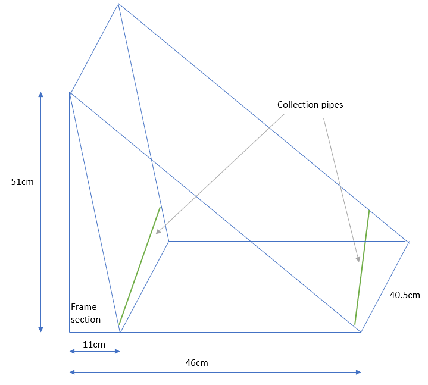

&nbsp;
&nbsp;

# EXPERIMENT IN FULL

# Summary

Currently, there are large inhabited areas of land that are close to the sea, but short of fresh water.

There are also inhabited areas where non-saline water is available, but the water is contaminated with dirt and other pollutants.

In many areas around the world, the infrastructure is not present to provide water to living areas as required.

This investigation looked to identify a means by which drinkable water could be obtained in a cheap manner. 

***Thought was at the ‘individual’ scale, not at ‘government’ scale, meaning any solution should be cheap, mass producible and easy to transport.***

The solution aimed to avoid the use of complex/ expensive parts, such as filters.

Several ideas were tested, with the final solution being a sealed evaporation/distillation unit. 

The tests showed a yield of >7% clean water could be generated on a hot day without an external power source. This could be improved upon with the right conditions/materials.

The setup could be converted to something that could possibly be designed to collapse like a camping chair for large scale production.

# Background

There are a few options for obtaining clean water. Some of these are:

**Rainwater Collection (Small and Large Scale)**

As used in most of Europe.

**Large Scale Sea Water/ Brackish Water Desalination Plants (Large Scale)**

These require a lot of energy and often complex technology, such as filtration systems.

**Boil and save the evaporate (as seen in camping/survival videos)**

This appears to work well as a small-scale option, but it has several drawbacks. It needs a strong heat source (fire) and general supervision, which may not be available, or convenient.

**Boil and save the evaporate (using electricity)**

Small scale distillation machines are available. The units are fairly expensive and require electricity. This unit costs around £45. 
https://www.vevor.co.uk/water-distiller-c_10700/water-distiller-purifier-4l-stainless-steel-internal-dental-1l-h-brand-p_010684350944?gclid=EAIaIQobChMI7dLA4I72-QIV1GDmCh3oLwyqEAQYAyABEgLW6_D_BwE 

**Water Purification Tablets**

These work well for clear water, but do not remove particulates and cannot handle saline water.

**Small Scale Water Filter Systems**

These can work well, but require regular maintenance and potentially water to backwash the filters. They may also struggle if water is dirtier than expected.

&nbsp;

# Aim

To create a ‘small scale’ device for purifying water, without the need for expensive equipment and maintenance, as seen with filters.

The solution should not require power and be usable in hot countries where infrastructure is poor and fresh water is not easily available.

Ideally, such a device would be collapsible, like a camping chair for example.

 
# Thinking Behind the Idea

Using an analogy, in scalable computer systems, there are two options:

1.	Scale Up (use a bigger computer)
2.	Scale Out (use lots of little computers)

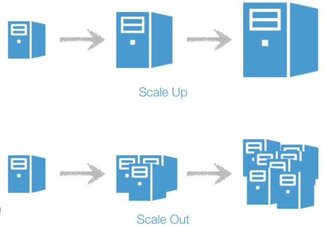

This can translate into the water and energy market. 

For example, Solar panels are a good example of ‘scale out’ – lots of small units deployed on rooftops form a solution for reducing reliance on power stations.

For water, the solution needs to not be connected to an ‘overall system’ in order to scale out.

Currently, many solutions look at providing water to an entire town (scale up), but there are not many small ‘scale out’ solutions. 

A scale out solution would be to provide individuals/ groups with equipment to harvest their own water. 

Small scale distillation units could be easily deployed to people who need them, bypassing (potentially corrupt/ inept) governments and helping people in need directly.

Such devices could require little oversight meaning they could be left unsupervised.

 &nbsp;

# Trials

## 1. Trial 1: Initial Evaporation Trial

&nbsp;

On a day of around 25°C, two trays were put outdoors on a table as shown in fig. 1

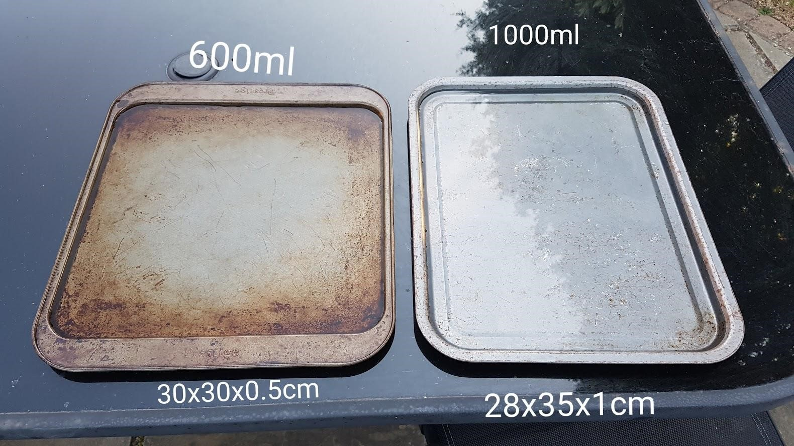
 
*Fig.1 – Two trays set out for evaporation*

The two trays were left for 24 hours. 

**Results**

Tray 1 (on the left, 600ml) was completely dry
Tray 2 (on the right, 1000ml) had evaporated 550ml water.
The reason for the slightly lower evaporation rate in the larger vessel is believed to have been the larger body of water taking more energy to heat.

For this reason, the first tray was used in subsequent tests.\

&nbsp;

## 2. Trial 2: Further Investigations on Solar Power

&nbsp;

A large container was put in the car on a day of 25°C to see the impact a strong heat could have on water. This is shown in figure 2
  
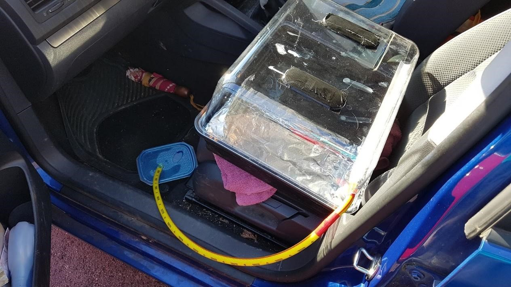

*Fig. 2 – Heating unit in the car*

After 24 hours, the water was approx. 55°C. 

**Results**

The system did not collect any water. This was considered to be due to the following:
 	- It was not sufficiently air tight
	- The angle at the top was not sufficient for droplets to slide down into the drip tray

&nbsp;

# 3. Trial 3: First Distillation Unit

&nbsp;

A crude home-made unit was devised to capture evaporate. It was designed to fit tightly around the 600ml tray from Trial 1.

The structure had 2 compartments. The front for collecting water and a back compartment for helping airflow and potentially collecting water.

The front consisted of a plastic wrapped slope with a collection pipe attached to capture evaporate running back down the plastic. The idea being that evaporated water would rise up, condense, then run back down the plastic

The back compartment was surrounded by aluminium foil on the outside and inside (reflective side facing towards the ‘front chamber’ to keep that compartment cool. 

The system was topped with insulating materials to try to create a lower temperature surface at the top to aid condensation. 

Fig. 3, 3a, 4 and 5 show the design. Fig. 6 shows the evaporate running down into the collection tray.

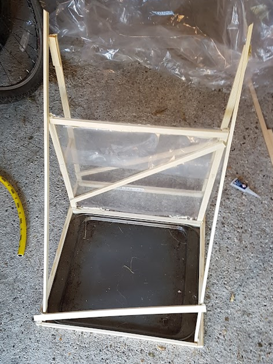
&nbsp;
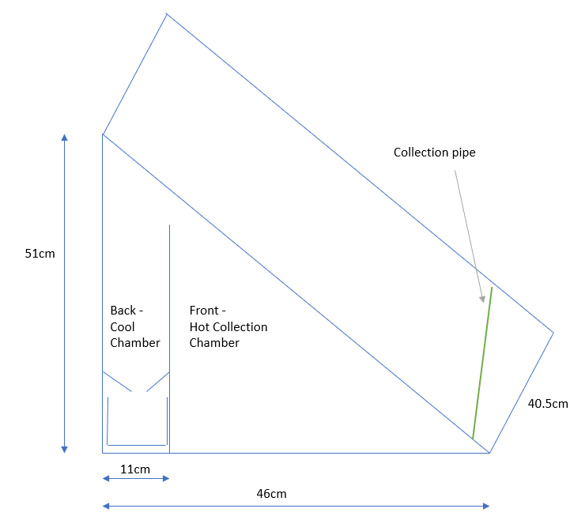

    
*Fig.3/3a Structure of device, with chamber at back for cooling. Foil was added to the inside for further reflection of heat to keep the back chamber cool. The front and back chambers were not separated to improve air movement.*

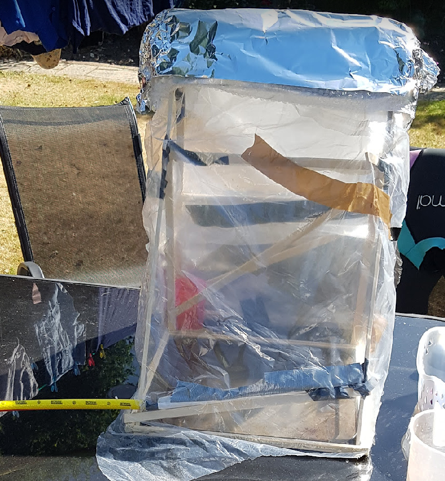

*Fig. 4 Device At Start*

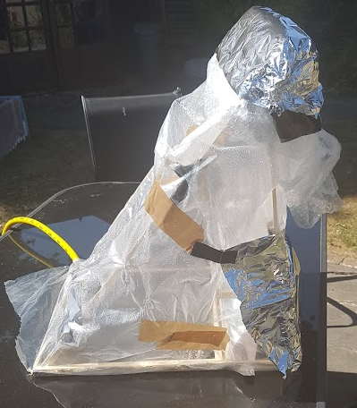

*Fig. 5 – Device Side View*

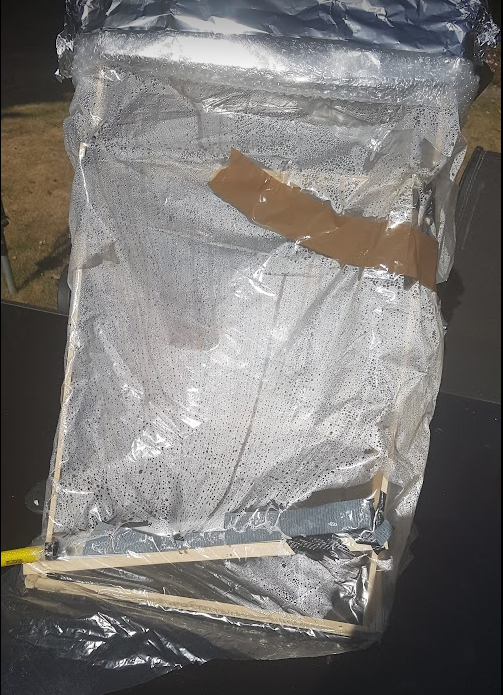

*Fig 6. Device working*

This model was put outside with 600ml water for approx. 7.6 hours (9:45->17:22) on a day around 25-26°C (felt hotter). The surface of the table it was on was noticeably hot at the time of the results.
The plastic (material from a mattress delivery) seemed to work well at both heating and inducing condensate.

**Results**

Nothing was collected from the chamber at the back. The front plastic was tapped before collection to encourage the last of the evaporate into the collection tray. 

48ml was captured. This is a yield of 8%.

&nbsp;
&nbsp;

# 4. Trial 4: Complicated Design

This design was overly complex and not worthy of reporting on.

Fig 7. Omitted from report.

&nbsp;
&nbsp;

# 5. Trial 5: Simplified Distillation Unit

&nbsp;

A simplified design was created with no collection at the top and no ‘cool unit’ at the rear. 

It was effectively a slanted A-frame (see Fig.9). The rear was sloped so both the front and back surface were capable of collecting evaporate. The same metal base was used as shown in [Trial 3](#3-trial-3-first-distillation-unit).

The frame was not connected to the tray at the bottom, but fit snugly to avoid water loss.

Fig. 8 shows the unit. Fig.9 shows the side profile. Fig. 10 shows the unit working. Fig. 11 shows a diagram of the unit.
The insulative top idea was retained from the previous setup to try to aid condensation.
  
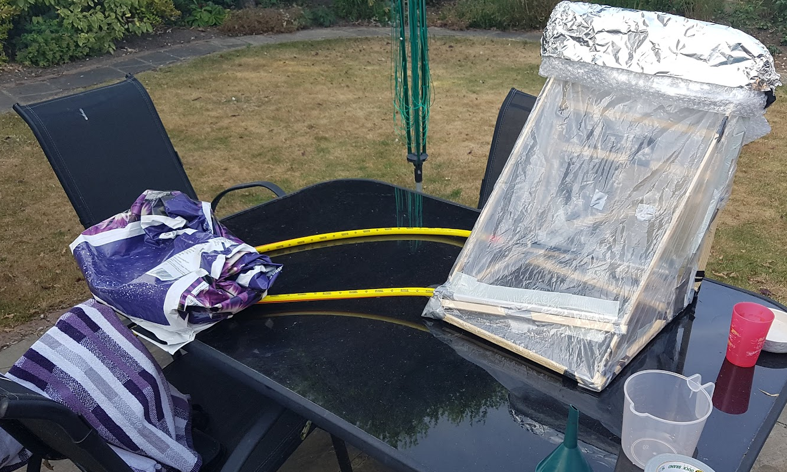

*Fig. 8 Simplified unit at setup*

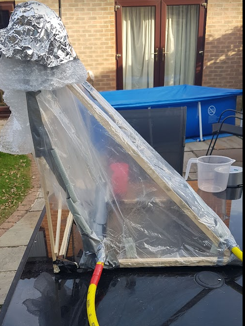
 
*Fig. 9 – Simplified Unit – Side Profile*

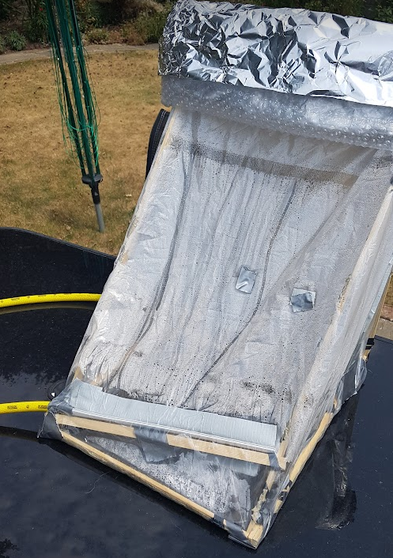
 
*Fig. 10 – simple design with evaporate being collected.*

 
*Fig 11. Diagram of the unit*

**Results**

The unit was placed in a westerly facing direction and was in the shade for parts of the day however, overall, it received a good amount of sunshine.

The unit was placed outside for 23 hours 18:30-17:00 (next day) with 600ml water in. The day rose to 33°C. 

The front collected 35ml water. The rear collected 3ml. Overall 38ml -> 6.3% yield. 

This yield was lower than expected. This was due to the drip trays not being set up properly. During the test, it was noticed that drips were going back into the main tray rather than being collected. See next section for improvements made.

&nbsp;
&nbsp;

# 6. Trial 6: Simplified Distillation Unit (Improved Collection)

&nbsp;

Note: See Trial 5 for full images of the unit.

The unit from trial 5 was put out again, but with larger drip collection trays as shown in Fig. 12

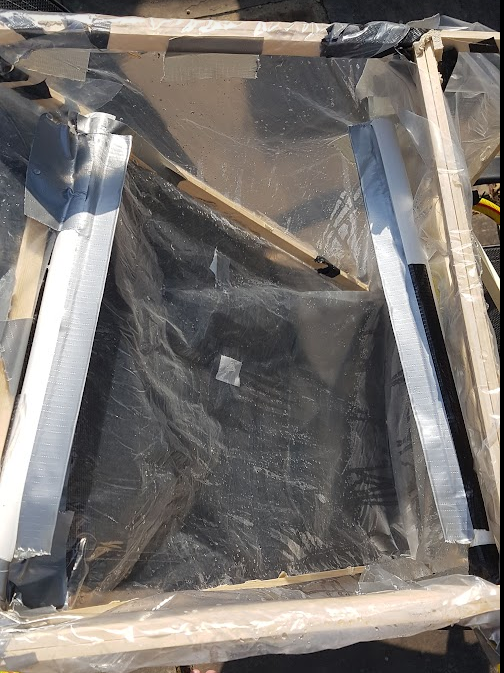
 
*Fig.12 Improved Collection Ducts*

600ml water was added to the tray. The test ran from 17:30-20:00 (next day) i.e. 26.5 hours.

**Results**

No water was harvested on the first evening. 
The next day got up to 33°C, however cooled down significantly (and rained) from 16:00 on the second day. This means that although the unit was out for 26.5 hours, almost all water was collected between 07:00 and 16:00 (9 hours). The collection vessels were sealed, so rain water ingress was not a concern. 

Collection from the rear was 7ml. Collection from the front 38ml. 
Overall collection 45ml (7.5% yield).

&nbsp;
&nbsp;

# Conclusion

&nbsp;

The tests showed that, on a hot day, a yield of at least 7% distilled water can be obtained.

Evening/Overnight collection was very low. The night could affect the daytime performance by either cooling the water (thereby requiring more energy to heat in the day), or heating it (thereby requiring less energy to heat in the day). 

Test timings were inconsistent due to the need to rapid prototype in a brief period of hot weather in Britain.

As expected, the results were heavily weather dependent. A cool breeze or shower was found to hamper collections. However, the expectation is that this device would be used in hot climates. 

It should be noted that the table on which the device sat also got hot, which may have improved results over putting the device on a cold surface.

Improvements to design and materials could yield a better result.

A collapsible version along these lines could be mass manufactured and deployed to those who need it.

